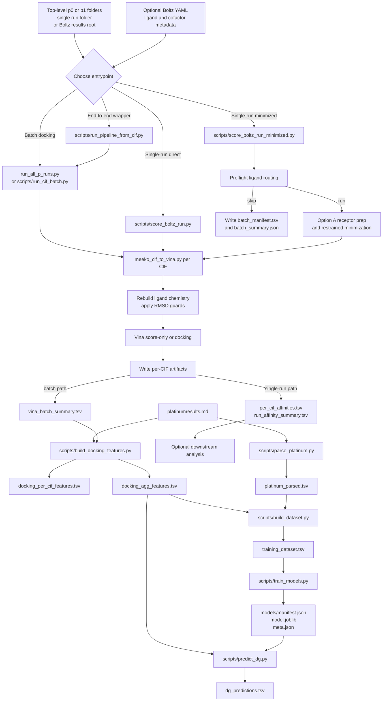

# Pipeline Flowchart

This diagram reflects the current implemented flow centered on
`scripts/score_boltz_run_minimized.py`, `run_all_p_runs.py`,
`meeko_cif_to_vina.py`, and the `affinity/` calibration modules.

## Notes

- Top-level batch discovery is limited to repository-root folders named `p0*`
  and `p1*`.
- The minimized runner classifies each CIF as `run`, `skip`, or runtime
  `error`.
- Ligand chemistry and pose consistency are enforced before Vina execution.
- The calibration chain joins aggregate docking rows to Platinum data on
  `(target_key, ligand_key)`.
- The code is intentionally fail-fast and does not introduce fallback routes
  when required chemistry, routing, or tooling is missing.
