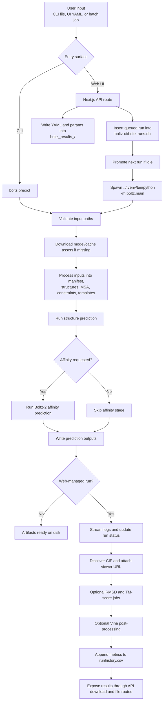

# Boltzbase Platform Flowchart

```mermaid
flowchart TD
    A[User input<br/>CLI file, UI YAML, or batch job] --> B{Entry surface}
    B -->|CLI| C[boltz predict]
    B -->|Web UI| D[Next.js API route]

    D --> E[Write YAML and params into<br/>boltz_results_<name>/]
    D --> F[Insert queued run into<br/>boltz-ui/boltz-runs.db]
    F --> G[Promote next run if idle]
    G --> H[Spawn ../.venv/bin/python<br/>-m boltz.main]

    C --> I[Validate input paths]
    H --> I
    I --> J[Download model/cache assets if missing]
    J --> K[Process inputs into manifest,<br/>structures, MSA, constraints, templates]
    K --> L[Run structure prediction]
    L --> M{Affinity requested?}
    M -->|Yes| N[Run Boltz-2 affinity prediction]
    M -->|No| O[Skip affinity stage]
    N --> P[Write prediction outputs]
    O --> P

    P --> Q{Web-managed run?}
    Q -->|No| R[Artifacts ready on disk]
    Q -->|Yes| S[Stream logs and update run status]
    S --> T[Discover CIF and attach viewer URL]
    T --> U[Optional RMSD and TM-score jobs]
    U --> V[Optional Vina post-processing]
    V --> W[Append metrics to runhistory.csv]
    W --> X[Expose results through API download and file routes]
```
