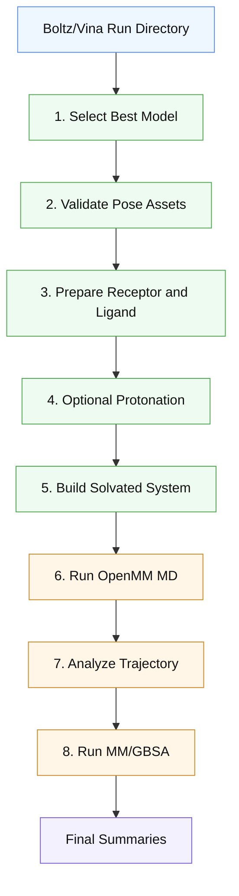

# Pipeline Flowchart

This document contains the editable Mermaid source for the current implemented
workflow.

## Flow Diagram



## At A Glance

```text
boltz_results_* input
  -> model selection
  -> pose validation
  -> preparation
  -> optional protonation
  -> solvated system build
  -> OpenMM MD
  -> trajectory analysis
  -> MM/GBSA
  -> final summary
```

## Stage Summary

### 1. Select Best Model

- input: Boltz/Vina batch ranking outputs
- output: `selected_model.json`

### 2. Validate Pose Assets

- input: selected CIF, receptor PDB, ligand SDF
- output: `pose_validation.json`

### 3. Prepare Receptor And Ligand

- input: selected structural assets
- output: receptor/ligand preparation artifacts

### 4. Optional Protonation

- protein mode: PROPKA/PDB2PQR
- ligand mode: Epik

### 5. Build Solvated System

- output: `complex.prmtop`, `complex.inpcrd`, `complex_solvated.pdb`,
  `prep_summary.json`

### 6. Run OpenMM MD

- output: stage snapshots, production trajectory, `md_summary.json`

### 7. Analyze Trajectory

- output: `analysis/trajectory/trajectory_summary.json`

### 8. Run MM/GBSA

- output: MM/GBSA reports and `analysis/mmgbsa/mmgbsa_summary.json`

### 9. Final Summaries

- output: `run_summary.json`, `pipeline.log`
