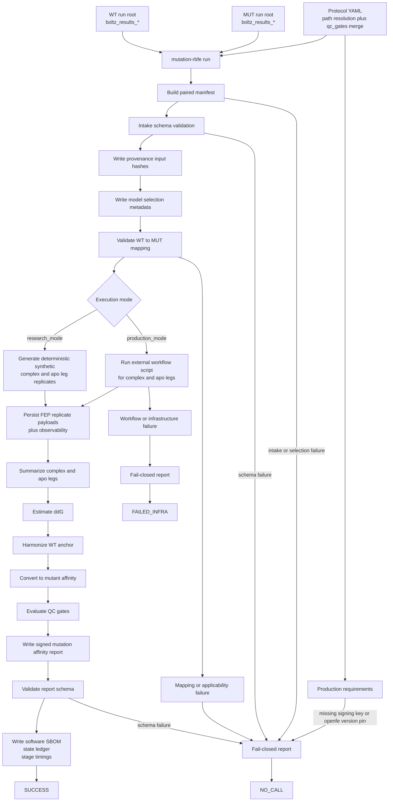

# Pipeline Flowchart

This diagram reflects the current pipeline implementation in `src/pipeline.py`,
`src/fep/pmx_runner.py`, and the current CLI/config behavior.

## Notes

- Supported mutation scope is one or more substitutions on the same chain.
- `research_mode` exercises the full pipeline with synthetic leg values.
- `production_mode` delegates leg execution through the configured workflow
  script.
- All terminal outcomes write a report artifact; the pipeline is intentionally
  fail-closed.
