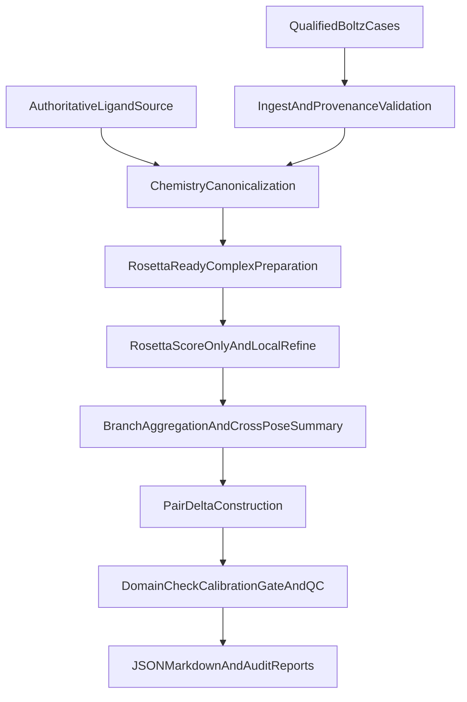

# Design Specification

This document describes the current implemented architecture of the Affinity
Pipeline. It focuses on the concrete Boltz-to-Rosetta runtime path in this
repository rather than the broader sponsor-governance program.

## Architecture Summary

The pipeline is organized as a staged, fail-closed system:



## Design Goals

- deterministic file and manifest contracts
- one validated ingest path for Boltz structures regardless of original file
  suffix
- authoritative ligand chemistry separated from structure coordinates
- Rosetta-ready preparation with explicit atom-name reconciliation
- pair-native reporting instead of treating raw Rosetta scores as a finished
  affinity endpoint
- fail-closed behavior for ambiguity, unsupported chemistry, or regulated-mode
  precondition failures

## Main Components

### Ingest

`src/affinity_pipeline/ingest/` is responsible for:

- locating Boltz provenance artifacts
- discovering confidence JSONs and structure files
- selecting the top confidence Boltz samples
- normalizing `.cif`, `.mmcif`, and `.pdb` handling into one internal path
- writing `ingest/run_manifest.json` and `ingest/case_manifest.json`

The ingest layer copies the selected source artifacts into the work directory so
later stages operate on pinned local inputs.

### Chemistry Preparation

`src/affinity_pipeline/chemistry/` handles:

- loading the authoritative ligand from `sdf`, `mol`, `mol2`, `smiles`, or
  `ccd`
- canonicalizing ligand chemistry with RDKit
- generating Rosetta params artifacts
- mapping authoritative ligand atoms to both Boltz coordinates and Rosetta atom
  names
- building `complex_rosetta.pdb` with ligand residue `LIG` on chain `X`

This stage is the core translation layer between Boltz coordinates and
Rosetta-safe inputs.

### Rosetta Execution

`src/affinity_pipeline/rosetta/` performs:

- XML protocol rendering from templates under `configs/rosetta/templates/`
- Rosetta command construction with `-extra_res_fa`
- isolated per-run environment construction
- score-only baseline execution
- local-refine replicate execution
- `score.sc` parsing for downstream aggregation

The Rosetta stage operates only on prepared PDB and params artifacts produced by
the chemistry layer.

### Aggregation And Calibration

`src/affinity_pipeline/aggregation/` and
`src/affinity_pipeline/calibration/` implement:

- per-pose Rosetta summaries
- cross-pose disagreement metrics
- branch-level summary fields
- paired delta feature construction
- operating-domain checks
- calibration-bundle application when allowed
- QC status assignment

This is the stage where branch-level Rosetta outputs become a pair-native
mutation-effect report.

### Reporting And Qualification

`src/affinity_pipeline/reporting/` writes:

- `score_report.json`
- `score_report.md`
- `audit_log.jsonl`

`src/affinity_pipeline/qualification/` handles:

- environment qualification manifests
- regulated-mode gating against qualified Rosetta installations

## Data Flow

### Single Case

```text
RunManifest
-> ingest/case_manifest.json
-> prepared/prep_manifest.json
-> rosetta/*/run_manifest.json
-> reports/score_report.json
-> reports/score_report.md
-> reports/audit_log.jsonl
```

### Pair Workflow

```text
PairRunManifest
-> branches/reference/*
-> branches/mutant/*
-> paired feature construction
-> reports/score_report.json
-> reports/score_report.md
```

## Runtime Modes

The code supports exactly three modes:

- `research`
- `shadow`
- `clinical`

Mode changes affect:

- cross-format strictness
- calibration expectations
- environment-manifest requirements
- whether missing calibration becomes a fail-closed error

## Failure Model

The design intentionally blocks rather than guessing:

- unsupported chemistry is rejected
- missing provenance is rejected in stricter modes
- cross-format mismatch can stop the run
- missing calibration in regulated modes becomes `FAIL_NO_RESULT`
- a clinical environment must match the qualified manifest

## Relationship To Other Docs

- `docs/affinity_pipeline_implementation_spec.md` is the curated implementation
  entrypoint
- `docs/cli_reference.md` documents the executable surface
- `docs/runtime_artifacts_reference.md` documents the on-disk outputs
- `docs/paired_mutation_scoring_method.md` explains how branch features become
  paired mutation-effect outputs
