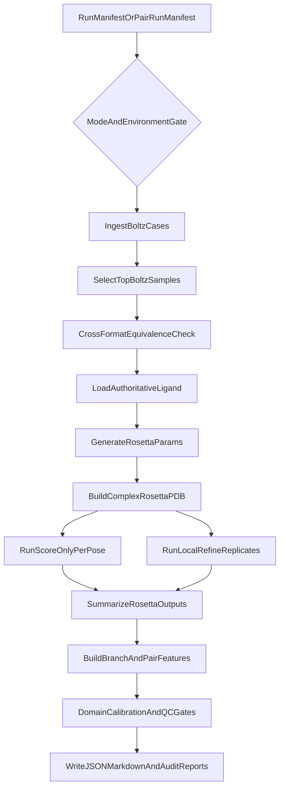

# Pipeline Flowchart

```mermaid
flowchart TD
    manifest[RunManifestOrPairRunManifest] --> modeGate{ModeAndEnvironmentGate}
    modeGate --> ingest[IngestBoltzCases]
    ingest --> sampleSelect[SelectTopBoltzSamples]
    sampleSelect --> formatCheck[CrossFormatEquivalenceCheck]
    formatCheck --> ligand[LoadAuthoritativeLigand]
    ligand --> params[GenerateRosettaParams]
    params --> prepare[BuildComplexRosettaPDB]
    prepare --> scoreOnly[RunScoreOnlyPerPose]
    prepare --> localRefine[RunLocalRefineReplicates]
    scoreOnly --> summarize[SummarizeRosettaOutputs]
    localRefine --> summarize
    summarize --> pairing[BuildBranchAndPairFeatures]
    pairing --> domainGate[DomainCalibrationAndQCGates]
    domainGate --> reports[WriteJSONMarkdownAndAuditReports]
```
